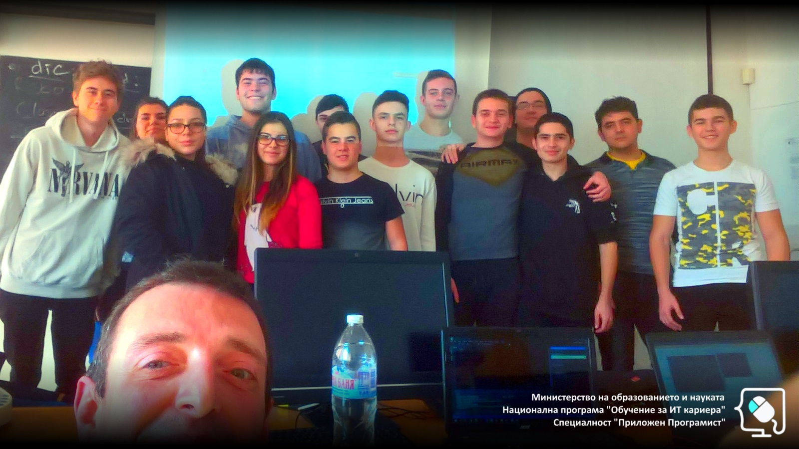

# Обучителен модул "Програмиране"
- Национална програма "Обучение за ИТ кариера"
- Професия "Приложен програмист" 
- Образователен център: Професионална имназия по електротехника и електроника "Константин Фотинов", гр.Бургас  
- Електронен портал: https://it-kariera.mon.bg/e-learning/

## Преподавател
- доц. д-р Димитър Минчев
- e-mail: dimitar.minchev@gmail.com 
- blog: http://www.minchev.eu

## Учебна програма
1. Системи за контрол на версиите
2. Бройни системи
3. Типове данни
4. Масиви и списъци
5. Дебъгване
6. Символни низове
7. Многомерни масиви
8. Речници и хеш таблици
9. Условия на задачи и тестове

## Обучаеми

